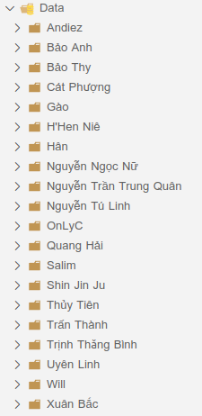
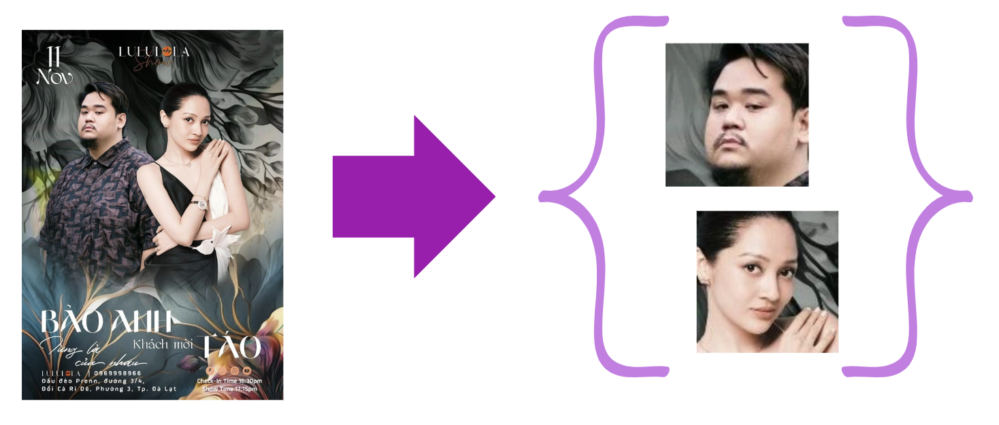
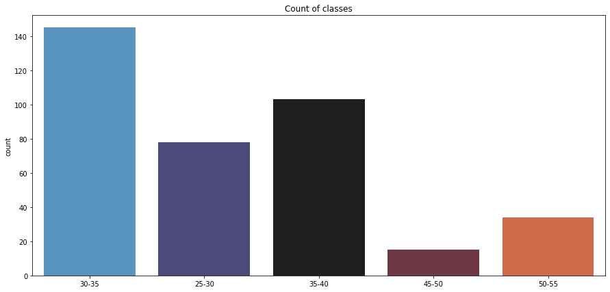
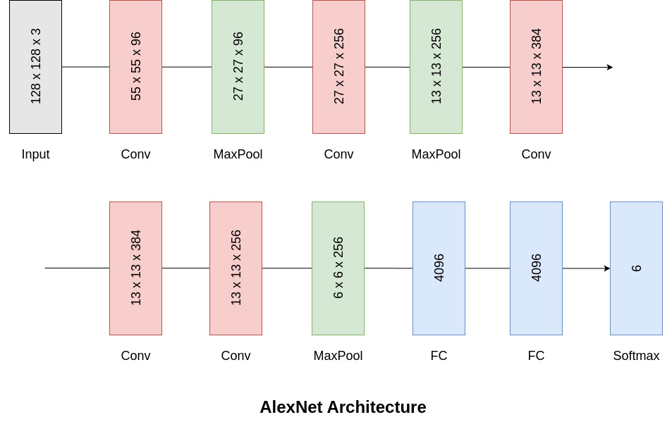
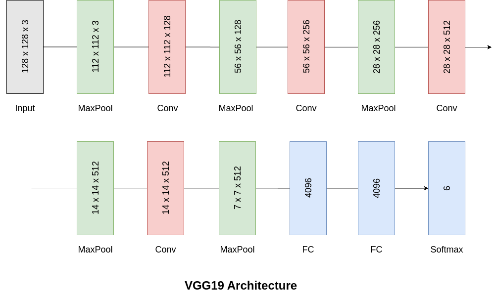
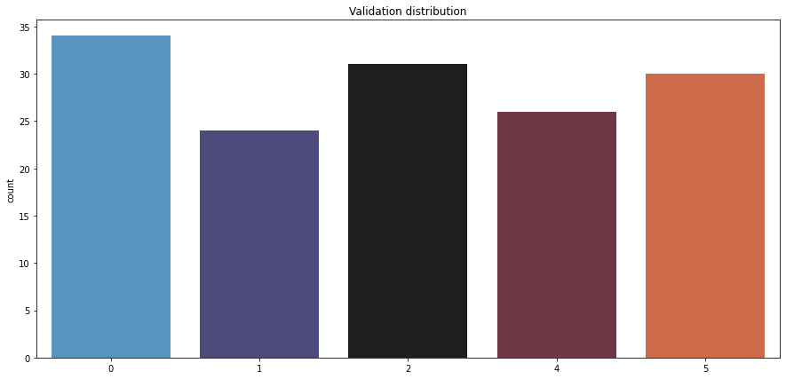

Vietnamese Age Estimation
=========================

## I. Introduction

Nowadays, marketing campaigns are often divided into small groups based on different age groups. Each age group has different characteristics, needs, and interests. Therefore, in order to segment customers into appropriate campaigns, it is necessary to know their ages. From there, we want to build a model to estimate the age of Vietnamese people. However, it is difficult and not realistic to predict a person's age accurately, so we focus on predicting the age group.

## II. Data Mining 

To build a model to predicts the age of Vietnamese people, we need a dataset that shows the dependences of Vietnamese people's age on their characteristics. 
In this project, we chose Vietnamese celebrities to collect data because their background information (age, image) is easy to find. However, using the images of celebrities also has many challenges. One of them is that they are often younger than their actual age.

### 1. Crawl data

- First, we come up with a list of celebrities (file txt) that covers most of the ages from 25 to 55 because this age range often appears in marketing campaigns. For each celebrity, we only take a certain number (about 70) of images in order to avoid the model biasing towards one or a few celebrities. 

- So how do we get their data? We use [Selenium](https://www.selenium.dev/) - a useful tool for collecting data automatically. Selenium simulates accurately how we operate with mouse and keyboard: access Google images, search for images of celebrities in the list, select ``"Open image in new tab"`` and get the image link.

- After this step, we have a list of image links corresponding to the artists. Then, we use the Python library ``requests`` to download and save to the corresponding folder of celebrities’ names to get the raw dataset.

 

### 2. Crop faces

- After observing a few images, we noticed some issues that need to be addressed:
The image may contain more than one person.
People in the images may not be the celebrities targeting.
Context factors (lighting, background, etc).
- For the solutions, we use the [OpenCV](https://opencv.org/) face detection model to identify all faces in images (including target celeb and others). To increase accuracy, we use **haarcascade_frontalface_default** model with ``minNeighbors=30``.
- As a result, our dataset only contains faces.

### 3. Filter

- As mentioned above, the dataset is still confusing between celeb’s faces and unwanted objects. To remove this, we use a model that can verify whether the image is the face of the target celeb.
- First, we select one representative image of each celeb (called ``sample.jpg``). 
- In the next step, we use [Face-Comparison](https://github.com/m-lyon/face-comparison) to verify this side of view. This model uses an autoencoder to compress the images into embedding vectors and then uses L2Norm to calculate the distance between them. In case the distance is less than ``0.7``, the two faces are considered to belong to the same person. Otherwise, this image would be eliminated from the dataset because it belongs to unwanted objects.
- After this step, we have a dataset with **375** face images of over **20** different celebs. At this point, each celeb’s folder only contains their own faces, not mixed with other artists. Now, we could label the folder following the artist’s age.

### 4. Group data

To achieve the original goal of this project, we need to group the images into appropriate data groups (age). We divided our dataset into groups (25–30, 31–35, 36–40, 41–45, 46–50, and 51–55). Therefore, the number of classes is now 6 instead of 31, which makes the prediction better and simpler.

 

## III. Models

### 1. AlexNet architecture

  

### 2. VGGNet architecture

- We using transfer learning technique with ``VGGNet19``, pretrained weight is [imagenet](https://www.image-net.org/).
- This is our model:

  

- We do not retrain VGGNet19, we only train last 3 full-connection layers and get some good results.

### 3. Results

- We use 80% of data for training and the remaining for testing. We use ``cross entropy`` loss function and ``accuracy`` metric.
- Distribution of dataset:

  

- The Alexnet model exhibites signs of underfitting, with an accuracy of **34.57%** on the training set and **31.58%** on the test set.
- The VGG19 model exhibites overfitting, with an accuracy of **97%** on the training set but only **45.33%** on the test set. So, data upsampling is applied to address class imbalance, raising the minority class to **725** samples. This improves test accuracy but seems to fail to eliminate overfitting, as evidences by the significant gap between training and test set accuracies (**99.31%** and **77.24%**, respectively).

|     |Baseline| Alexnet | VGG19 | VGG19 no sampling |
|-----|--------|---------|-------|:-----------------:|
|Train|20.86%  |34.57%   |99.31% |97.00%             |
|Test |23.45%  |31.58%   |77.24% |45.33%             |

<b>(Benchmarking Alexnet and VGG19)</b>

- The Alexnet model's underfitting may stem from its inability to extract image features, whereas the VGG19 model effectively learns these features utilizing pretrained ``ImageNet`` weights.

## IV. Conclusion

- After meticulous data collection and processing, we have developed a Vietnamese face dataset suitable for training an age prediction model. Despite its limited sample size, the dataset holds promising potential for future scaling due to its less manual processing requirements.
- The results of our experiments with two models suggest that transfer learning holds promise for future age prediction tasks. Additionally, understanding model characteristics is crucial to prevent overfitting and underfitting issues.
## IV. Far and further

### 1. Enhance dataset

- Our current dataset is still small and limited, so we want to improve its quantity and quality. We also want to include images of people besides celebrities. 
- We want to build a more accurate face verification model to improve the overall quality of the process.

### 2. Improve model:

- We want to use some boosting techniques (K-Fold, AdaBoost,...) to improve the performance of the model.
- Currently, the model is not performing well when using augmentation. In the future, we will try to find out the cause and apply more augmentation methods to increase the amount of data and improve the model for images with special factors (e.g., blurred, tilted, etc).
